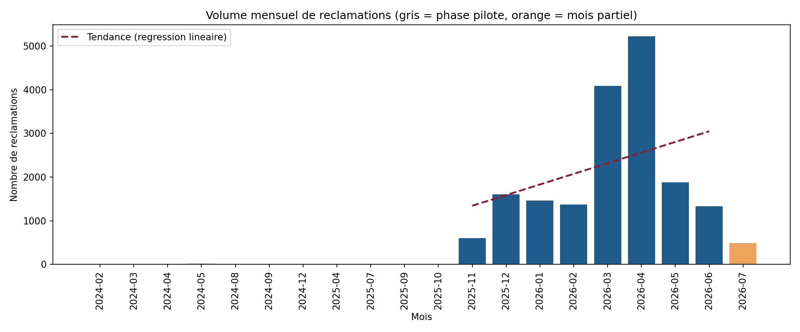
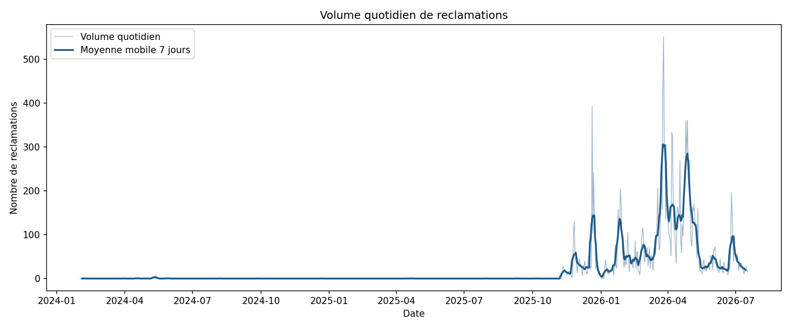
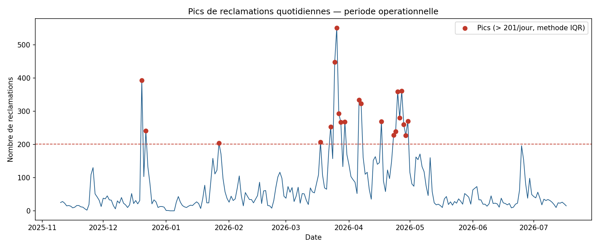
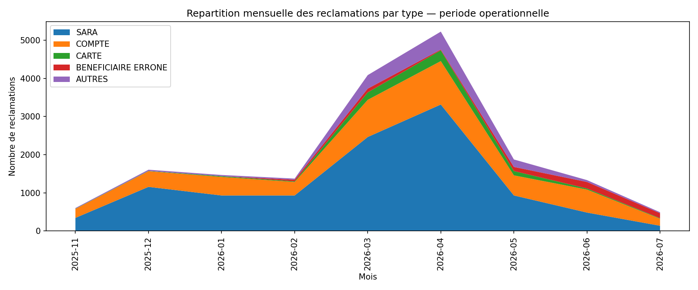
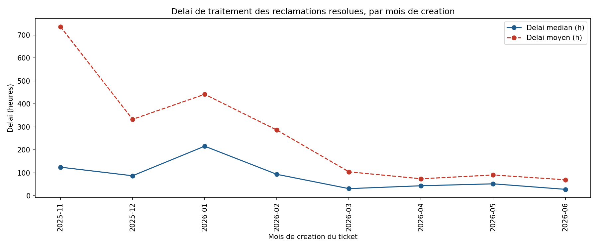

# Rapport — Évolution temporelle des réclamations

**Source** : `SRC_Intercom_Reclamation_202607201846.csv`
**Colonne de référence retenue** : `created_at` (date de création du ticket — colonne système fiable à 100%, cf. [rapport de statistique descriptive](../2- Statistique_Descriptive/Rapport_Statistique_Descriptive.md), section 3.4 : `ticket_attributes_Date de la transaction` a été écartée pour cette analyse car saisie à la main et fiable à seulement 38%)
**Date du rapport** : 29/07/2026

Ce rapport documente l'évolution dans le temps des réclamations, produite par les scripts du dossier [`src/`](src/). Chaque script écrit une table dans [`resultats/tables/`](resultats/tables/) et un graphique dans [`resultats/figures/`](resultats/figures/).

---

## 1. Constat préalable : deux périodes bien distinctes

Avant toute analyse de tendance, l'agrégation mensuelle brute (script `02_serie_mensuelle.py`) révèle que le volume de réclamations est **négligeable de février 2024 à octobre 2025** (1 à 23 tickets/mois, 38 tickets cumulés sur 11 mois), puis **bascule brutalement à partir de novembre 2025** (600 tickets ce mois-là, puis plus de 1000/mois ensuite).



**Interprétation** : la période antérieure à novembre 2025 correspond très probablement à une phase pilote / de test du canal Intercom, et n'est pas représentative d'une activité réelle. **Toute la suite de l'analyse se concentre donc sur la période opérationnelle : novembre 2025 → juillet 2026** (le seuil de détection — 100 tickets/mois — est documenté et modifiable dans le script). Le mois de juillet 2026 est par ailleurs **partiel** (extraction faite le 20/07/2026, soit 17 jours sur 31) : il est signalé en orange sur le graphique et ne doit pas être comparé tel quel à un mois complet.

Table complète : [`02_serie_mensuelle.csv`](resultats/tables/02_serie_mensuelle.csv)

---

## 2. Volume quotidien



- Période complète couverte : 2024-02-01 → 2026-07-17 (898 jours), total 18 094 réclamations.
- Sur la période opérationnelle uniquement, le volume est très irrégulier jour après jour (la moyenne mobile 7 jours le montre bien), avec des pics ponctuels très marqués plutôt qu'une croissance régulière.

Table complète : [`01_serie_quotidienne.csv`](resultats/tables/01_serie_quotidienne.csv)

---

## 3. Tendance générale

Une régression linéaire sur les 8 mois complets de la période opérationnelle (nov. 2025 → juin 2026) donne :

- **Pente : +244 réclamations/mois** (tendance à la hausse sur l'ensemble de la période)
- **R² = 0,14** → cette droite explique très mal les données. Ce n'est **pas une croissance régulière** mais une **bosse** : forte hausse en mars-avril 2026 (jusqu'à 5 228 tickets en avril), puis retour à un niveau proche de fin 2025 dès mai-juin 2026.

**Conclusion à retenir pour le manager** : parler d'une simple "tendance à la hausse" serait trompeur. Le bon résumé est : *volume stable autour de 1 300–1 600 tickets/mois de nov. 2025 à fév. 2026, pic marqué en mars-avril 2026 (x3), puis retour à la normale dès mai 2026.*

---

## 4. Pics identifiés et hypothèse de cause

Méthode : bornes IQR calculées sur les comptages quotidiens de la période opérationnelle (script `03_pics_anomalies.py`). Borne haute : **201 réclamations/jour**. **21 jours** (8,4% des jours de la période) dépassent ce seuil.



Les 3 pics les plus importants :

| Date | Nb réclamations | Type dominant | % du type dominant ce jour-là |
|---|---|---|---|
| 2026-03-26 | 551 | SARA | 58.1% |
| 2026-03-25 | 448 | SARA | 68.3% |
| 2025-12-20 | 393 | SARA | 88.3% |

**Constat marquant : les 21 jours de pic sont tous dominés par le type de réclamation "SARA"** (50 à 88% des tickets du jour). Ce n'est pas un hasard statistique — cela pointe vers un **incident ou dysfonctionnement récurrent lié au produit/service SARA**, concentré sur la période mi-mars → fin avril 2026, à faire valider par l'équipe technique/produit concernée.

Table complète : [`03_pics_anomalies.csv`](resultats/tables/03_pics_anomalies.csv)

---

## 5. Confirmation par la répartition par type de réclamation



La décomposition mensuelle par type confirme l'hypothèse : le pic de mars-avril 2026 est **presque entièrement porté par SARA** (2 463 puis 3 315 tickets, contre ~930 les mois calmes), pendant que le type "COMPTE" reste sur une trajectoire beaucoup plus stable/progressive sur toute la période. SARA retombe ensuite fortement dès mai 2026 (930 → 135 en juillet), cohérent avec un incident résolu plutôt qu'une dégradation structurelle.

Table complète : [`05_repartition_type_mensuel.csv`](resultats/tables/05_repartition_type_mensuel.csv)

---

## 6. Délai de traitement dans le temps

Calculé comme `updated_at - created_at`, **uniquement pour les tickets au statut `resolved`** (1 690 tickets, 9,3% du total — les tickets encore `submitted` n'ont pas de date de résolution exploitable).



| Mois de création | Délai médian | Délai moyen |
|---|---|---|
| 2025-11 | 125 h (~5,2 j) | 736 h |
| 2025-12 | 87.6 h | 333 h |
| 2026-01 | 216 h | 442 h |
| 2026-02 | 93.9 h | 286 h |
| 2026-03 | 31.6 h | 105 h |
| 2026-04 | 44.1 h | 74.5 h |
| 2026-05 | 52.5 h | 91 h |
| 2026-06 | 28.6 h | 70.1 h |

**Bonne nouvelle à mettre en avant** : le délai de traitement **s'améliore nettement** sur la période, malgré le pic de volume de mars-avril (delai médian passé de ~125h à ~29-52h). Le fort écart entre moyenne et médiane (ex. 736h vs 125h en nov. 2025) indique la présence de quelques dossiers très longs à traiter qui tirent la moyenne vers le haut — la médiane est donc l'indicateur le plus représentatif ici.

Table complète : [`04_delai_traitement_mensuel.csv`](resultats/tables/04_delai_traitement_mensuel.csv)

---

## 7. Synthèse pour le manager

1. Le canal de réclamation n'a un volume significatif que depuis **novembre 2025** — tout ce qui précède est une phase pilote à ignorer dans les comparaisons.
2. La tendance globale n'est **pas une hausse continue** mais un **pic isolé en mars-avril 2026**, largement expliqué par le type de réclamation **SARA** — à faire confirmer par l'équipe produit (incident technique probable sur cette période).
3. Hors ce pic, le volume mensuel est stable (~1 300–1 600 tickets/mois).
4. Le **délai de traitement des réclamations résolues s'améliore fortement** dans le temps (division par ~4 à 5 entre nov. 2025 et juin 2026).
5. Seuls 9,3% des tickets sont marqués `resolved` dans l'export — à clarifier avec le métier si les 90% restants (`submitted`) reflètent un vrai arriéré ou un usage différent du statut dans Intercom.

---

## 8. Comment reproduire

```bash
cd "niv2- tutoré/3- Evolution_Temporelle/src"
python3 01_serie_quotidienne.py          # volume quotidien + moyenne mobile 7j
python3 02_serie_mensuelle.py            # agregation mensuelle + tendance + detection periode operationnelle
python3 03_pics_anomalies.py             # pics quotidiens (methode IQR) + hypothese de cause
python3 04_delai_traitement.py           # delai created_at -> updated_at (tickets resolus)
python3 05_repartition_type_mensuel.py   # repartition mensuelle par type de reclamation
```
