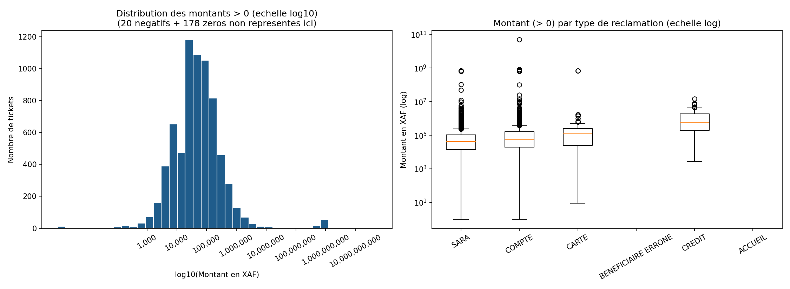
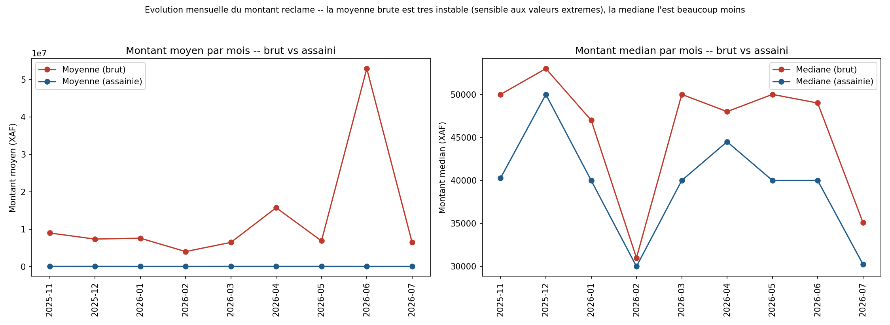
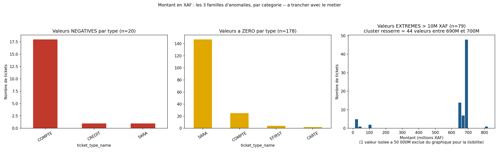

# Rapport — Analyse du champ Montant en XAF

**Source** : `SRC_Intercom_Reclamation_202607201846.csv`, colonne `ticket_attributes_Montant en XAF`
**Date du rapport** : 29/07/2026

**Pourquoi ce rapport séparé** : la [statistique descriptive](../2- Statistique_Descriptive/Rapport_Statistique_Descriptive.md) a signalé des anomalies sur ce champ (négatifs, zéros, valeurs extrêmes) et recommandé de ne calculer aucun agrégat financier avant validation métier. Cette recommandation **tient toujours** — mais anomalie ne veut pas dire "à ignorer" : certaines de ces valeurs peuvent être volontaires côté métier (ex. un montant négatif pour signaler une régularisation). Ce rapport produit donc les graphiques et l'analyse malgré tout, pour donner au métier des éléments concrets permettant de trancher, plutôt que de s'arrêter au simple signalement.

Scripts : [`src/`](src/) — tables : [`resultats/tables/`](resultats/tables/) — figures : [`resultats/figures/`](resultats/figures/)

---

## 1. Distribution générale



- 7 230 tickets ont un montant renseigné (40,0% du dataset) : **20 négatifs, 178 à zéro, 7 032 strictement positifs**.
- Le corps de la distribution (panneau gauche) suit une forme régulière en cloche sur l'échelle logarithmique, centrée entre 10 000 et 500 000 XAF — cohérent avec des montants de transactions bancaires courantes.
- Un **second amas isolé apparaît nettement entre 100 millions et 1 milliard XAF**, séparé du corps principal par un grand vide — visible aussi bien sur l'histogramme que sur les boîtes à moustaches par type (panneau droit, points au-dessus de 10⁷).

Table complète (répartition par tranche) : [`01_distribution_montant.csv`](resultats/tables/01_distribution_montant.csv)

---

## 2. Évolution mensuelle : pourquoi la moyenne brute ne doit pas être utilisée



Deux versions calculées côte à côte, sans trancher à la place du métier :
- **brut** : toutes les valeurs renseignées
- **assaini** : hors négatifs/zéros/valeurs au-delà de la borne haute IQR (321 000 XAF) — à titre indicatif uniquement, pas un chiffre officiel

**Constat très net** : la moyenne brute varie de **4,0 millions à 52,9 millions XAF** d'un mois à l'autre (panneau gauche, courbe rouge qui part dans tous les sens), pendant que la moyenne assainie reste plate près de 0 sur le même graphique — l'échelle est totalement dominée par une poignée de valeurs extrêmes. À l'inverse, la **médiane brute et la médiane assainie suivent quasiment la même trajectoire** (panneau droit, ~30 000 à 53 000 XAF selon les mois), preuve que la médiane est peu sensible à ces quelques valeurs aberrantes.

**Recommandation opérationnelle** : si un indicateur de montant doit être suivi dans le temps en attendant la validation métier, utiliser la **médiane**, pas la moyenne.

Table complète : [`02_evolution_montant_mensuel.csv`](resultats/tables/02_evolution_montant_mensuel.csv)

---

## 3. Les 3 familles d'anomalies, décomposées



### 3.1 Valeurs négatives (20)
**18 sur 20 (90%) concentrées sur le seul type "COMPTE"**, les 2 autres isolées (CREDIT, SARA). Cette forte concentration sur un type précis, plutôt qu'une dispersion aléatoire sur tous les types, **plaide pour un usage volontaire** : plausible qu'un montant négatif signale une régularisation ou un remboursement dû au client sur ce type de réclamation, plutôt qu'une erreur de saisie qui serait attendue de façon plus dispersée.

### 3.2 Valeurs à zéro (178)
**147 sur 178 (83%) concentrées sur le type "SARA"**. Cohérent avec l'hypothèse déjà posée dans le rapport de statistique descriptive : SARA concerne souvent des transferts où l'argent n'est jamais arrivé — un montant à 0 peut refléter qu'aucune somme n'a été effectivement transférée, ou que le champ n'est simplement pas pertinent pour ce type de ticket.

### 3.3 Valeurs extrêmes (79 tickets > 10M XAF)
C'est ici que se trouve l'élément le plus troublant : sur les 79 valeurs extrêmes, **44 (56%) sont resserrées dans une fourchette très étroite entre 690 000 000 et 699 994 900 XAF** (panneau de droite : un pic massif juste avant 700M, presque rien ailleurs). Un vrai montant de fraude serait plutôt dispersé (chaque fraude a un montant différent) — un **amas aussi resserré juste sous un seuil rond (700 millions) ressemble davantage à un artefact technique** (plafond de génération de données, valeur par défaut, bug d'un générateur aléatoire) **qu'à 44 réclamations de fraude indépendantes et de montant quasi identique**. Un seul cas est vraiment isolé, à 50 milliards XAF (probable erreur de saisie avec des zéros en trop).

Table détaillée des 79 valeurs extrêmes : [`03_anomalies_extremes.csv`](resultats/tables/03_anomalies_extremes.csv)

---

## 4. Synthèse pour trancher avec le métier

| Anomalie | Constat chiffré | Hypothèse la plus plausible au vu des données |
|---|---|---|
| Négatifs (20) | 90% sur le type COMPTE | Usage volontaire (régularisation/remboursement) — à confirmer |
| Zéros (178) | 83% sur le type SARA | Transfert non abouti / champ non pertinent pour ce type |
| Extrêmes (79) | 44 valeurs resserrées entre 690M-700M XAF | Probable artefact technique (plafond/génération), pas 44 fraudes réelles |
| Extrême isolé (1) | 50 milliards XAF, cas unique | Erreur de saisie (zéros en trop) |

Ces hypothèses restent **à valider avec le métier** — l'objectif de ce rapport est de fournir des éléments concrets (répartition par type, forme de la distribution) pour trancher rapidement, pas de se substituer à cette validation. Aucun agrégat financier officiel ne doit être communiqué avant cette confirmation.

---

## 5. Comment reproduire

```bash
cd "niv2- tutoré/4- Analyse_Montant_XAF/src"
python3 01_distribution_montant.py         # distribution generale + boxplot par type
python3 02_evolution_montant_mensuel.py    # evolution mensuelle, brut vs assaini
python3 03_anomalies_par_categorie.py      # negatifs / zeros / extremes, par categorie
```
